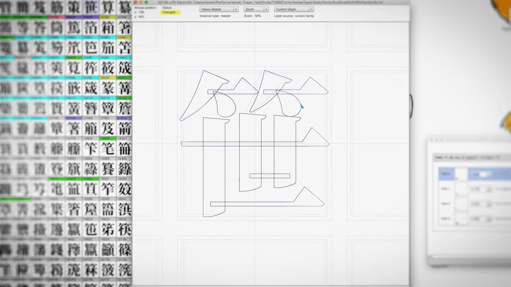
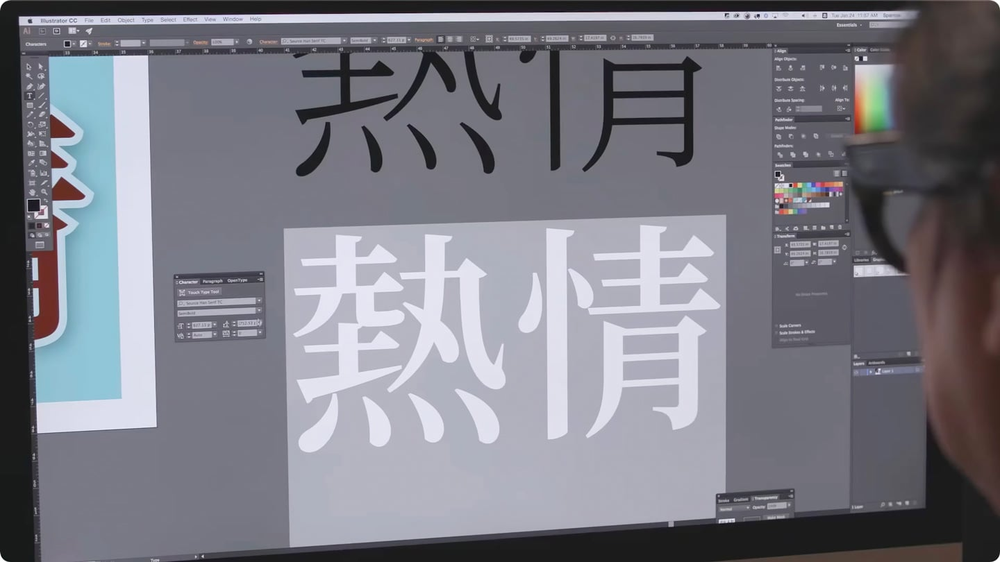
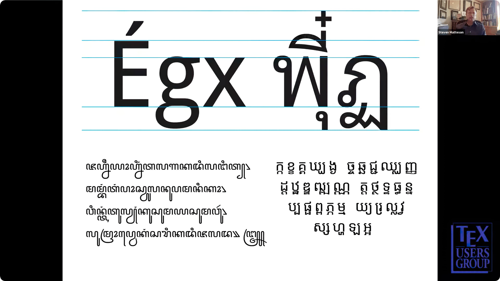
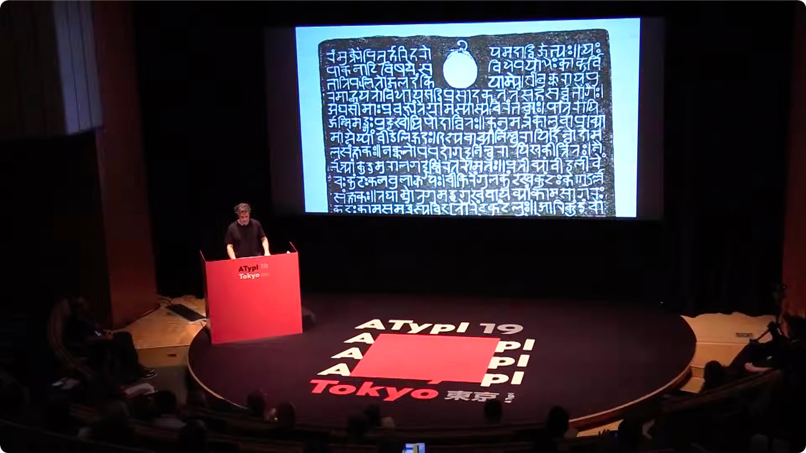

# Noto: A typeface for the world

## Free fonts for all languages

Noto is a collection of high-quality free fonts for writing in all modern and ancient languages. With multiple weights and widths in sans, serif, mono, and other styles, Noto fonts are perfect for harmonious, typographically correct communication in more than 1,000 languages and over 150 writing systems.

“Noto” means “I write, I mark, I note” in Latin. The name is also short for “no tofu”, as the project aims to eliminate 'tofu': blank rectangles shown when no font is available for your text.

### Read and write text in any language

Nearly half of the 6,000 languages spoken in the world are endangered. Noto includes fonts for nearly all of the world’s writing systems (scripts): from Latin, Chinese, Arabic, Hebrew, and all Indic scripts, to Egyptian hieroglyphs and emoji.

The designs are harmonious across scripts but retain the authentic flavors that make each script special. The fonts use Unicode and OpenType (ISO Open Font) international standards for accurate, professional-quality rendering of all orthographies.

### Internationalize your visual design

Business documents require a range of styles to convey document structure visually. Noto offers 100s of styles that form a modular, flexible typographic system — for designers, writers, publishers, advertisers, software makers, students, and scholars everywhere.

If you’re already using some font for your language, complement it with selected Noto fonts of similar styles for other languages. Or use the entire Noto font collection to create clean, consistent typography across many scripts and languages.

### Write with confidence

Google has developed Noto with Monotype, Adobe, and leading experts from around the world. The letterforms are crafted by experienced type designers. Script experts supervise the aesthetic and typographic correctness.

The fonts are available as variable and static OpenType fonts, as CSS web fonts, and in source formats that make customization easy. The development process is transparent and open-source.

### Use for free in print and digital

Need fonts for your website, book, app or product? All Noto fonts are licensed under the Open Font License, which permits redistribution.

You can use them freely in your products & projects — print or digital, commercial or otherwise. However, you can’t sell the fonts on their own. (This isn’t legal advice, please consider consulting a lawyer and see the [[full license]{.ul}](https://github.com/googlefonts/noto-fonts/blob/main/LICENSE) for all details.)

## Learn more

World scripts are as diverse as humans, they have different proportions and writing directions. One font file could not fit them all, so Noto includes 100s of font files in several formats.

### How Noto was made

“When it comes to lesser-used languages, or even the purely academic or dead languages, we think it’s really important to preserve them.” — Bob Jung, Google. Google and Monotype made Noto together ([7-minute video](https://youtu.be/16_NYHUZ1kM)).

### How Noto CJK was made

Noto CJK and its sister project, Source Han, made by Adobe and Google, provides users of Chinese, Japanese, and Korean languages with powerful tools for digital text communication ([6-minute video](https://youtu.be/yNfYdxgV1jA)).

### Noto fonts for developers

Without the right font for the right language, the design of an app can quickly be destroyed. Noto fonts provide harmonious look and feel across over 1,000 languages. Bundle them with your app or use on the web ([7-minute video](https://youtu.be/AAzvk9HSi84)).

### The road to Noto

“The scope of the project was so big, it’s really a change in mindset in how you’re going to work. You know you’re not going to be done tomorrow or next week. You have to give it time.” Steve Matteson, lead type designer ([42-minute video](https://youtu.be/HHIFL7DxOP0)).

### Invisible letters, invisible language

43% of the 6,000 languages spoken in the world are endangered. “In an increasingly computerized world, many languages remain invisible.” Zachary Scheuren ([20-minute video](https://youtu.be/PcS_mE5dDCw)).

### Endangered languages and accessibility

Learn more about the most recently developed Noto variable fonts, their impact for endangered language communities and accessibility, and how you can contribute to the project to make reading truly universal ([52-minute video](https://youtu.be/DnuDOlPkFag)).

